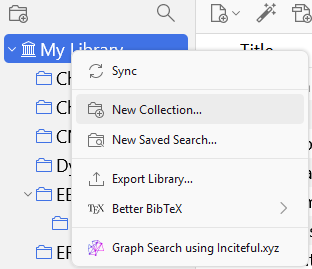
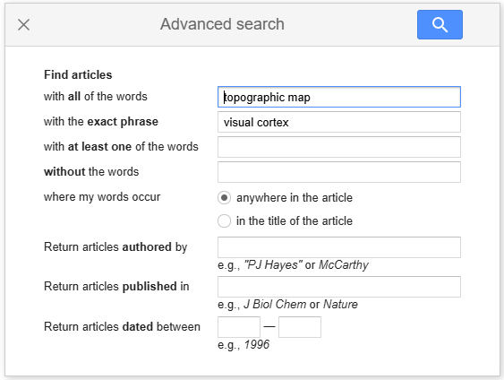
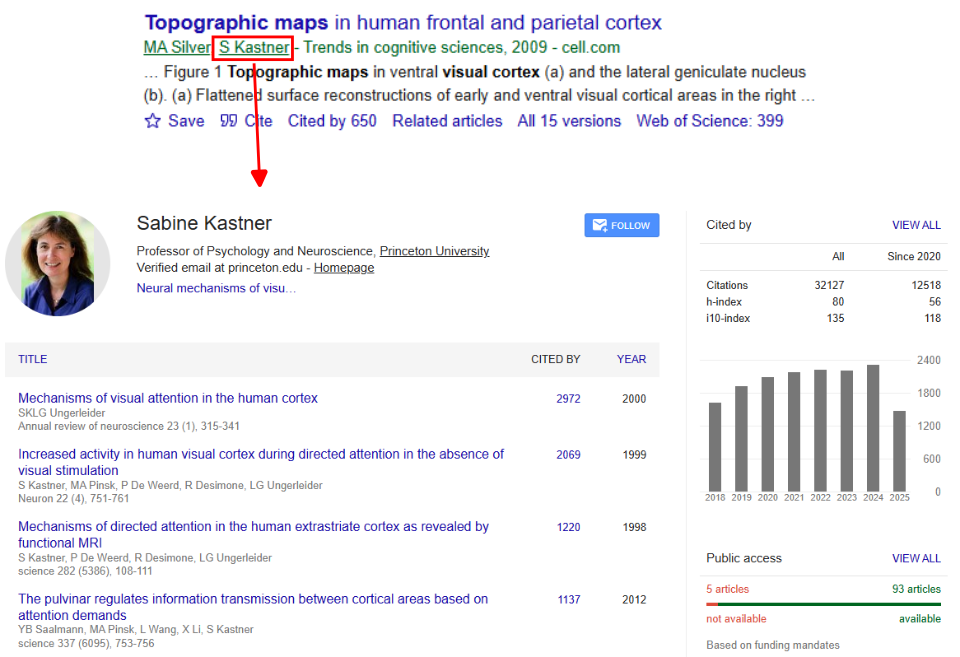
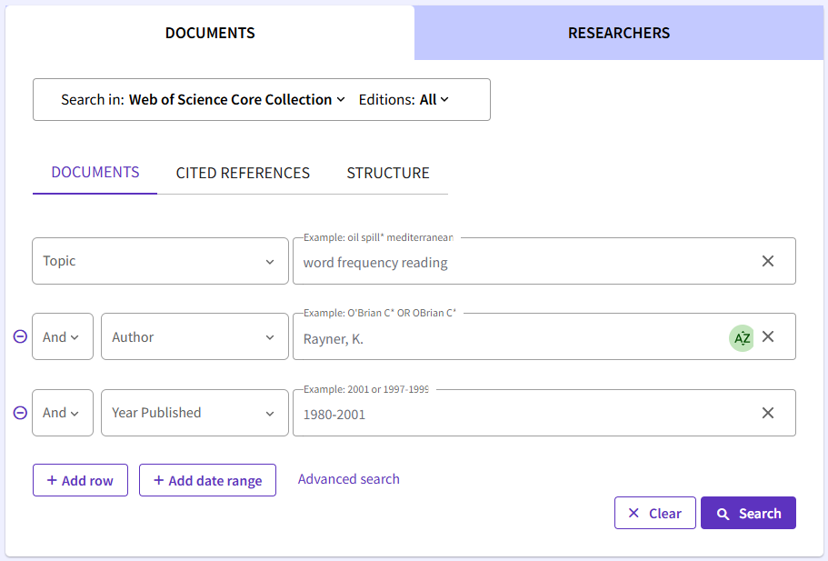
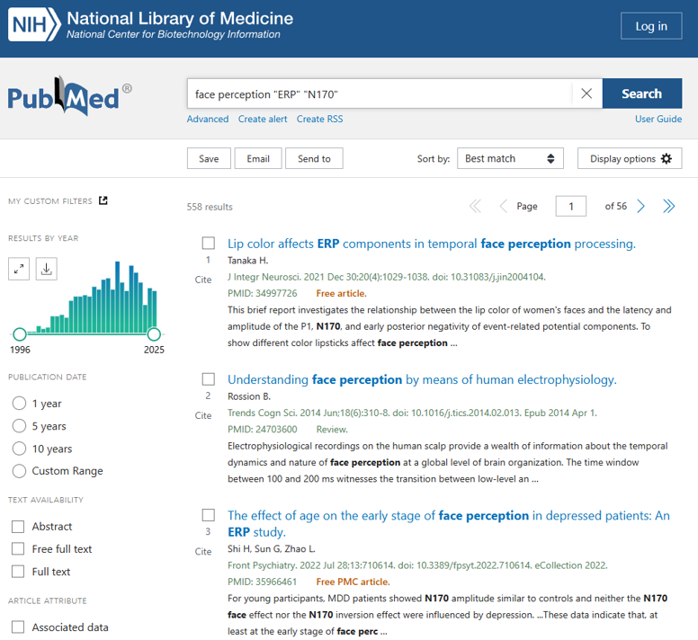

# Literature Search and Reference Management

A key skill in scientific research is finding and keeping up with literature. In Psychology, this mostly means journal articles and preprints. Once we have found relevant literature, we also want to make sure that we record and keep track of the references we have found, so that we can find them later when we need them. This is called *reference management*.

There are lots of ways to find and organise literature. A simple Google Scholar search is a good start, but there are lots of techniques that can save us time and make us much more effective.

In this session, we will cover:

[1. How to Manage Literature](#how-to-manage-literature-zotero)  
[2. Search Engines for Literature](#search-engines-for-literature)  
    - Using [Google Scholar](#google-scholar), [Web Of Science](#web-of-science), [PubMed](#pubmed)  
    - [Tips and tricks for search engines](#tips-and-tricks-for-search-engines)  
[3. Using Citation Patterns to Find Literature](#using-citations-to-find-literature)  
[4. Tools for Literature Search/Review](#tools-for-literature-searchreview)  
    - [Citation-Based Tools](#a-citation-based-tool-inciteful)  
    - [AI-Based Tools](#ai-based-tools)  
    - [Meta-Analysis Tools](#meta-analysis-tools-for-neuroimaging)  
    - [Mind Maps](#mind-maps)  
[5. How to Read a Paper](#how-to-read-a-paper)  

-----------------------------

## 1. How to Manage Literature: Zotero

An important first step is to make sure you have a way of keeping track of all the relevant papers you find. We recommend [Zotero](https://www.zotero.org/) as a tool to help with this.

[Zotero](https://www.zotero.org/) is an open-source reference manager, which makes it easy to:
* Keep track of bibliographies
* Automatically generate citations
* Store article pdfs

With Zotero, you can create "collections" for each course or research project you complete in your degree. You can do this by right clicking your library (on the left), and clicking *New Collection*. You could name this "ExPra".

Zotero provides [Zotero Connector](https://www.zotero.org/download/) - a plugin for your browser that lets you save articles directly to Zotero with just one click:

Zotero will usually also save the pdf file for you. In case it doesn't, you can tell it to download the article for you.

You can read pdfs directly in Zotero, and save notes so you can easily come back to them later.

-----------------------------

## 2. Search Engines for Literature

The three most popular search engines for finding scientific literature are Google Scholar, Web of Science, and PubMed.

### [Google Scholar](https://scholar.google.com/)

[Google Scholar](https://scholar.google.com/) is maybe the most common search engine for finding scientific literature and is a good place to start. However, it provides fewer options than Web of Science and PubMed.

Google Scholar is a popular tool for researchers, students, and academics, as it offers a simple and user-friendly interface for discovering and accessing a comprehensive library of scholarly literature across most, if not all, disciplines. It is also useful for looking at which papers cite each other, and for finding other papers by the same researchers.

You can use the search bar to enter keywords and other search terms, and there are extra filters for refining your results. 

 
 

On the google scholar results page, you can:
* Click on a title, or **All versions** to view a paper.
* Automatically generate a reference for a reference list by clicking **Cite**.
* Filter or sort by date.
* See who cited a paper (sometimes called a, "Backward search")

#### Advanced Search

Click on the `3 Bars` in the top right, next to the search bar, to reveal the Scholar menu. Here, you can select advanced search, which will open a pop-up looking like this:

This allows you to match phrases either in the title or text, exclude phrases, and filter by author, publication, and year range.

#### Google Scholar Alerts

You can also click on **Create alert** to set up E-mail notifications when new literature comes out that fits your search term. This can be very useful while working on, e.g., a thesis!

You can remove an alert, by going to the Scholar menu, clicking **Alerts**, and clicking the **Cancel** button.

#### Google Scholar Profiles

Researchers will often put together and maintain their own Google Scholar profile page. This can be useful if you want to see what other work a researcher has been doing. One easy way to get to a researcher's Google Scholar profile, is by clicking their name:

#### Extra Tips

* [Google Scholar: the ultimate guide (Paperpile)](https://paperpile.com/g/google-scholar-guide/)

 

-------------------------------

### [Web of Science](https://www.webofscience.com/wos/)

The [Web of Science](https://www.webofscience.com/wos/) is a powerful online database of research, including articles, conference proceedings, and patents.

Web of Science has some very useful search options, including citation searching, author searching, filtering by research field, and finding articles that also share their data.

Useful resources:
* [Youtube: Web of Science training](https://www.youtube.com/@WoSTraining/videos)
* [Intoduction course Web of Science](https://webofsciencelearning.clarivate.com/learn/course/external/view/elearning/72/web-of-science-essentials)
* [Web of Science Platform Training & Support](https://clarivate.com/webofsciencegroup/support/wos/)

---------------------------------

### [PubMed](https://pubmed.ncbi.nlm.nih.gov/)

[PubMed](https://pubmed.ncbi.nlm.nih.gov/) is a free online database of literature with a focus on biomedical sciences (including, e.g., neuroscience).

Like Web of Science, PubMed has some useful options for filtering results to focus on the most relevant results.

Useful resources:
* [Pubmed User Guide](https://www.ncbi.nlm.nih.gov/pmc/about/userguide/)

--------------------------

### The University Library

Goethe University Library provides access to its database of records, as well as e-books and journals that the university subscribes to.

Useful resources:
* [Goethe University Frankfurt Library search](https://www.ub.uni-frankfurt.de/home_en.html)
* [Goethe-University Frankfurt: Tips for literature search](https://www.ub.uni-frankfurt.de/benutzung/literaturrecherche_en.html)

You can also write an email to or visit the library to request help. Librarians are often more than happy to help you find what you are looking for!

    
-------------------------------

### Tips and Tricks for Search Engines

Here are a few handy tricks for making your searches more effective.

#### Phrase Search

Imagine you want to search for articles that mention the *visual world paradigm*. This is a specific form of experimental design that researchers often use to look at visual and language processes (see Huettig et al., [2011](https://doi.org/10.1016/j.actpsy.2010.11.003)). You could just search for `visual world paradigm`, but this might also match articles that just happen to mention all three words at some point in the article.

For example, you might find an article that has a title like, *Visual processing across the world: A new research paradigm*. This article includes all of the relevant words in the title, but isn't about the visual world paradigm.

Instead, you can use *phrase searching*, where you put quotation marks around the phrase you want to search for. If you search for `"visual world paradigm"` in quotation marks, the search engine will look for articles that use this exact phrase, including the spaces and the exact word order that you asked for.

#### Logical operators

You can combine keywords in your search with "logical operators", like AND, OR, and NOT. These can be useful if we want to exclude irrelevant results that include certain words or phrases.

**Example 1:** Imagine you are interested in how well people can train themselves to have better attentional control, so you search `attention training`. However, when we search `attention training` we might also start to find a lot of papers that come from computer science, where researchers are developing ways to (e.g.,) train attentional heads in artificial neural networks. You would like to exclude these articles.

**Example 2:** Imagine you are searching for research on working memory. You might decide that research that is about the closely related concept of *short term memory* is also relevant, so you would like to get articles that include either phrase.

We can solve these example problems with logical operators:

* We could exclude results that use the phrases "computer science" or "large language model" using the NOT operator. In Google Scholar, we can do this by putting a `-` symbol before the keyword or phrase we want to exclude. Example: `attention training -"large language model"`

* We could combine possible search terms with the OR operator. In Google Scholar, we can do this by searching for, e.g., `"working memory" OR "short term memory"`.

#### Proximity search

Sometimes we want to find a word that occurs close to another relevant word. For example, imagine we want to find articles that mention *healthy aging* in the context of *face recognition*. We can do this using the AROUND operator. For example, if we want to find articles that mention healthy aging within 25 words of face recognition, we could search for:

`"healthy aging" AROUND(25) "face recognition"`

#### Wildcards

A final useful trick is wildcards. Imagine we want to search for articles that are related to depression in adolescents. The words *depression* and *adolescent* might occur in articles, but so might *depressive*, *depressed*, *adolescents*, or *adolescence*. We could use wildcards to capture all of these:

`adolescen* depress*`

* `adolescen*` will match: adolescence, adolescents, adolescent, etc.
* `depress*` will match: depress, depression, depressive, depressed, etc.

------------------------------

 

## 3. Using Citations to Find Literature

When you have found a very relevant article for a topic you are researching. A really useful way of exploring literature is looking up:
1. Who does this article cite? (*Backward Search*)
2. Who cites this article? (*Forward Search*)

### Backward Search

When we do a backward search, we want to know what works are cited by a certain article. In this way, we are moving "backwards" in time, as all the cited references existed before the current paper.

To do a backward search, you can just scroll down to look at a paper's reference list. Combining this with the text of an article can tell you about the prior findings that informed the research.

In Web of Science, you can also click **Cited References** to get this list. This can be useful if you also want to filter the list or search the cited articles for key terms.

### Forward Search

A forward search tells us who cited a certain article in their own work. In this way, we are moving "forwards" in time, as all these papers came out after the current paper.

You can do a forward search in any of the three tools we have covered:
* In Google Scholar, click **Cited By**
* In Web of Science, click **Citations**
* In PubMed, click **Cited By**

You can then filter the results to identify the most relevant articles.

Here is an example of what that looks like in google scholar:

------------------------------

## 4. Tools for Literature Search/Review

As well as the search engine approaches above, there are also some helpful tools you might want to consider. These tools don't replace the literature search methods above, but can be effective tools when *combined* with a literature search.

### A Citation-Based Tool: [Inciteful](https://inciteful.xyz/)

Inciteful ([inciteful.xyz](https://inciteful.xyz/)) is a free tool for making forward and backward search easier. It creates a network of papers based on which papers are citing each other. It also provides a list of similar articles, based on the logic that papers that cite many of the same sources are likely to be related in topic too.

If you use Zotero, there is a handy plugin for quickly looking up a paper on inciteful: https://github.com/inciteful-xyz/inciteful-zotero-plugin

Other free apps which can be good alternatives to Inciteful include:
* [Researchrabbit](https://researchrabbitapp.com/): Requires free signup, but also lets you save "collections" for literature management (similar functions to Zotero).

### AI-Based Tools

Some recent tools use AI-based approaches, like large language models (LLMs), to explore and summarise the academic literature.

Examples include:
* [Consensus](https://consensus.app/): Provides tools for summarising papers, or querying what research shows on a given topic, and how much consensus there is across articles. Provides limited usage for free.
* [Elicit](https://elicit.com/): Provides tools for summarising papers. Provides limited usage for free.

### Meta-Analysis Tools for Neuroimaging

Some tools can use natural language processing (NLP) techniques to extract information from the texts of published studies, and use these data to generate statistical summaries of brain activity patterns across specific cognitive processes or experimental conditions.

These methods are far from perfect (e.g., sometimes combining conditions, participants, or analyses that don't make sense together), but can be useful as a first look into neuroimaging literature for a certain effect.

You can also export the list of papers and include them in your notes/research.

Two platforms for this are:
* [Neuroquery](https://neuroquery.org/)
* [Neurosyth](https://neurosynth.org/)

### Mind Maps

An approach you might find useful when reading literature, is to connect the articles you are reading to each other and your own work in a mind map.

This can help remind you where all the different articles fit in, and can help you structure your report when it comes time to write everything up.

## 5. How to Read a Paper

### "10 Simple Rules"

Carey et al. ([2020](https://doi.org/10.1371/journal.pcbi.1008032)) give some useful advice on how to read a paper.

They give 10 questions that you should ask yourself while reading a paper:
1. What do the author(s) want to know (motivation)? 
2. What did they do (approach/methods)? 
3. Why was it done that way (context within the field)? 
4. What do the results show (figures and data tables)? 
5. How did the author(s) interpret the results (interpretation/discussion)? 
6. What should be done next?

<iframe src="https://docs.google.com/presentation/d/e/2PACX-1vR_sjtfMswrYWEpfpQeDik8F-aFt0HHH4MfjaS2tJui1PzvaaekgrbCe9dIsVVtaeC4GrrpJNm6iuIl/pubembed?start=false&loop=false" frameborder="0" width=100% height=569 allowfullscreen="true" mozallowfullscreen="true" webkitallowfullscreen="true"></iframe>

### Do you have to read everything?

<iframe src="https://docs.google.com/presentation/d/e/2PACX-1vRiFDRgQ8x6ZRaYK26u0DzC4zq-pypROVz0zTl9lFTRGZldqe7AI6umpgK3_xw0Be2kJoarqzLJiC6r/pubembed?start=false&loop=false" frameborder="0" width=100% height=569 allowfullscreen="true" mozallowfullscreen="true" webkitallowfullscreen="true"></iframe>

----

**Acknowledgments**  
This section was contributed by [Jack Taylor](https://fiebachlab.org/team/taylor). 

