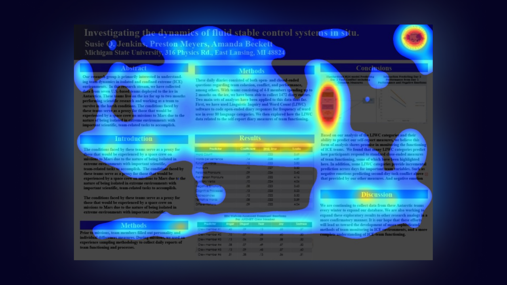
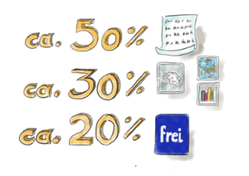
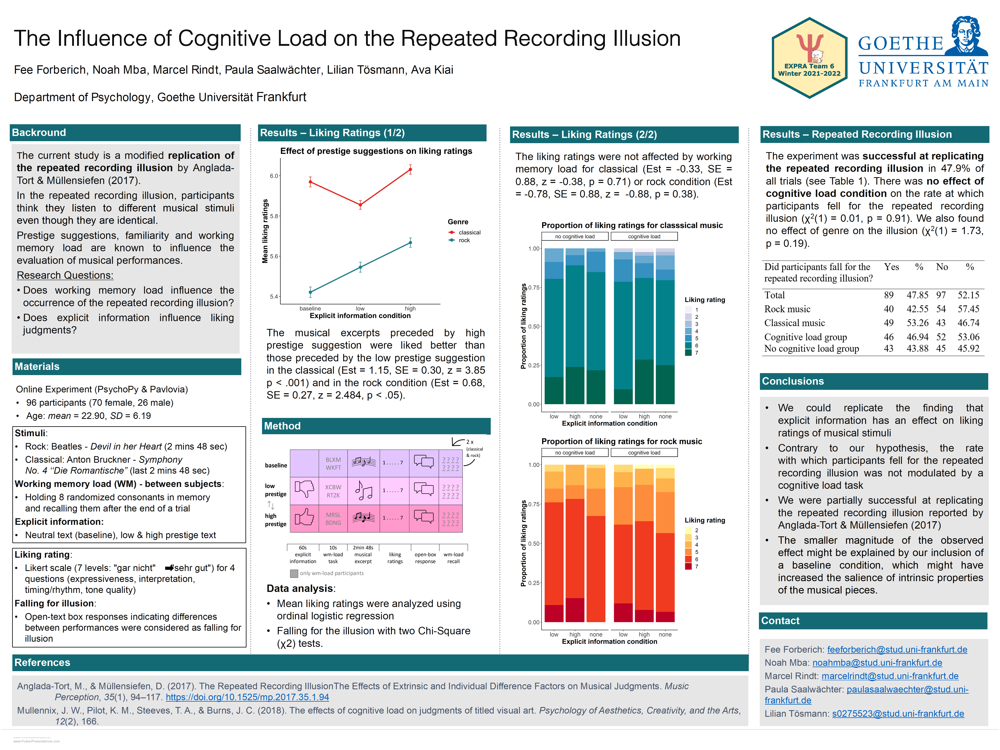

<style>
p:has(+ ul) {
  margin-bottom: 0.5em;
}
p + ul {
  margin-top: 0.5em;
}
p:has(+ ol) {
  margin-bottom: 0.5em;
}
p + ol {
  margin-top: 0.5em;
}
</style>

# Poster Design

When creating your poster, remember: **a good poster doesn´t follow a recipe, it follows a purpose**. There is **no rigid blueprint** for a scientific poster, but a clear structure is essential to present complex content understandably ([Burkhardt et al., 2017](https://www2.tuhh.de/zll/wp-content/uploads/2017_Das_wissenschaftliche_Poster_website.pdf)).


## Why are _good_ scientific posters important? 
(following [Burkhardt et al, 2017](https://www2.tuhh.de/zll/wp-content/uploads/2017_Das_wissenschaftliche_Poster_website.pdf))

-	Visual Communication & Simplification: Posters serve as a visual aid to clearly present complex scientific information and summarize research results concisely.
-	Discussion & Scientific Exchange: Their primary purpose is to stimulate discussions and encourage viewers to interact with the presenter.
-	Fundamental Competence: The ability to present one’s project understandably is an essential competence in academic studies and professional scientific fields. 

## What is a scientific poster and how is it structured?

:::{admonition} What is a scientific poster?
:class: note

A scientific poster is a visual communication medium primarily used to summarize and present findings in an illustrative and concise manner, displaying one’s own research at conferences and in seminars. Its main purpose is to provide a clear overview of complex scientific content and to stimulate discussions. It achieves this by combining textual and visual elements, with the reduction of content to the essentials ([Burkhardt et al., 2017](https://www2.tuhh.de/zll/wp-content/uploads/2017_Das_wissenschaftliche_Poster_website.pdf); [ISEK, 2014](https://www.isek.uzh.ch/dam/jcr:00000000-3970-ccc5-ffff-ffffdfb6e2d2/Poster2014.pdf); [Studierwerkstatt an der Universität Bremen, o. D.](https://www.uni-bremen.de/fileadmin/user_upload/sites/studierwerkstatt/Leitfaden_wissenschaftliche_Poster_erstellen.pdf)).
:::

### Structure 
(following [Burkhardt et al., 2017](https://www2.tuhh.de/zll/wp-content/uploads/2017_Das_wissenschaftliche_Poster_website.pdf); [ISEK, 2014](https://www.isek.uzh.ch/dam/jcr:00000000-3970-ccc5-ffff-ffffdfb6e2d2/Poster2014.pdf))

**1.	Title & Authorship**
-	capture viewer’s attention
-	title = meaningful, attractive, concentrating on the project’s core message, formulated as a question or clear statement 
-	place names & titles of participating scientists, along with the logo of the institution / company they represent

**2.	Introduction**
-	place topic within a broader scientific context / current state of research
-	clarify key terms 

**3.	Methodological Background**
-	present materials & methods: self-explanatory graphics may help to illustrate experimental procedures
-	brief sample description

**4.	Results**
-	present findings of the research graphically, using diagrams, photos, schematics, etc.
-	visuals should be accompanied by short, explanatory text that summarizes the most important findings
-	aim: visuals speaking largely for themselves, requiring minimal text for understanding

**5.	Discussion**
-	interpret the findings
-	connect findings to broader theoretical and practical implications & future research 

**6.	References / Bibliography**
-	cite all literature to avoid plagiarism (APA format)

````{tip}
```{figure} ../_static/wh-questions.png
---
scale: 40%
align: right
---
```

Wh-Questions to help structure your poster:  
([Studierwerkstatt an der Universität Bremen, o. D.](https://www.uni-bremen.de/fileadmin/user_upload/sites/studierwerkstatt/Leitfaden_wissenschaftliche_Poster_erstellen.pdf))
-	WHO investigates
-	WHAT
-	HOW
-	with WHICH result
-	for WHICH aim
-	on WHICH basis?                             
````

## Design principles – 3 levels of engagement 
(following Alean-Kirkpatrick, 2002a, 2002b, as cited in [Burkhardt et al., 2017](https://www2.tuhh.de/zll/wp-content/uploads/2017_Das_wissenschaftliche_Poster_website.pdf))

The following always applies to the design: avoid superfluous and disruptive elements ([Studierwerkstatt an der Universität Bremen, o. D.](https://www.uni-bremen.de/fileadmin/user_upload/sites/studierwerkstatt/Leitfaden_wissenschaftliche_Poster_erstellen.pdf)).

### Look at me – attracting attention & first impression 
(following [ISEK, 2014](https://www.isek.uzh.ch/dam/jcr:00000000-3970-ccc5-ffff-ffffdfb6e2d2/Poster2014.pdf))  
> The initial impression is crucial, with the first 10 seconds often determining if your poster generates interest ([Burkhardt et al., 2017](https://www2.tuhh.de/zll/wp-content/uploads/2017_Das_wissenschaftliche_Poster_website.pdf)).
-	divide poster into sections such as title, introduction, methodological background, results, discussion and references
-	white space is crucial to loosen up the poster & prevent overload
-	frames around text boxes are not necessary (if used, they should be fine lines, as bold ones may appear narrowing)
-	background images can make a poster illegible, a background in just one colour usually provides a greater contrast to the text
-	use of colours: 
  -	subtle & harmonious (too strong / bright colours may attract attention, but are tiring to read; soft colours radiate calm; dark / strong colours can appear restless; avoid colour gradients)
  -	putting information in the same colour may highlight their relation to each other 
  -	font colour should strongly contrast with the background (dark colours on a bright background are the easiest to read)
-	posters are typically in portrait format; DIN A0 (118.8 x 84.1cm) is the standard size in the ExPra, DIN A1 (84.1 x 59.4cm) may be used elsewhere
-	visual hierarchy guides the viewer´s attention, ensuring that key elements are seen first and the reading flow is intuitive rather than confusing (https://www.youtube.com/watch?v=4x0SLtCVFho)   
<p align="center">
  
&nbsp; &nbsp; &nbsp; &nbsp;
  
</p>

### Read me – ensuring readability & comprehensibility 
(following [ISEK, 2014](https://www.isek.uzh.ch/dam/jcr:00000000-3970-ccc5-ffff-ffffdfb6e2d2/Poster2014.pdf); [Studierwerkstatt an der Universität Bremen, o. D.](https://www.uni-bremen.de/fileadmin/user_upload/sites/studierwerkstatt/Leitfaden_wissenschaftliche_Poster_erstellen.pdf))  

The aim is for viewers to grasp a lot at a glance with minimal reading. The less text required for understanding, the clearer your poster will be ([Burkhardt et al., 2017](https://www2.tuhh.de/zll/wp-content/uploads/2017_Das_wissenschaftliche_Poster_website.pdf); [ISEK, 2014](https://www.isek.uzh.ch/dam/jcr:00000000-3970-ccc5-ffff-ffffdfb6e2d2/Poster2014.pdf)).

- content reduction: condense information to core statements & highlight results
- text vs. image ratio: rule of thumb = 50% images & 50% text



- text formatting: short, continuous text rather than bullet points or long paragraphs
- font choice: sans-serif fonts (e.g. Arial, Calibri) are easier to read from a distance than serif fonts
- font size: poster should be readable from a distance of up to 3 meters, therefore also use large line spacing (at least 6-7 mm) 
  - orientation aids for font sizes:
    - DIN A0: main heading 85-100 pt, subheading 50 pt, body text 28-32 pt
    - DIN A1: main heading 60 pt, body text 20-24 pt
    - references typically in a much smaller font size
      
- visual flow: information is read from top left to bottom right & important elements should be placed as centrally as possible, at eye level
- graphics & illustrations: self-explanatory & relevant, described in a short legend & not within flowing text, avoid complicated formulas, ensure sufficient image quality (min. 200dpi or 800x600 pixels)
      

### Ask me
Design your poster to encourage viewers to engage with you ([Burkhardt et al., 2017](https://www2.tuhh.de/zll/wp-content/uploads/2017_Das_wissenschaftliche_Poster_website.pdf)).
- sense of suspense, e.g. by designing the introduction so that the results appear surprising
- comparison with contrasting results could stimulate discussion 


## Step-by-step guide of creating a scientific poster 
(following [Burkhardt et al, 2017](https://www2.tuhh.de/zll/wp-content/uploads/2017_Das_wissenschaftliche_Poster_website.pdf); ISEK, 2014; Studierwerkstatt an der Universität Bremen, o. D.)  

**1.	Planning the work process**
-	Familiarize yourself with the design requirements & purpose of scientific poster. Plan your workflow by outlining what needs to be completed and by when.
-	Allocate sufficient time for the professional printing of your poster.

**2.	Developing content for the poster**
-	Translate your research findings into a poster-friendly format.
-	You may start by sketching your ideas on paper to visualize the arrangement of content elements 


-	When determining the final content, extract the core statements from your findings. A useful technique is to categorize information into "Need to know", "Good to know" and "Nice to know", prioritizing the "Need to know" information as it is crucial for understanding.
-	Emphasize your results, not the methods used.

**3.	Create a draft of the poster**
-	If using a program like PowerPoint, immediately set the correct poster size when you start the file. 
-	Process and optimize images before inserting them into the poster (e.g., using image editing software).

```{admonition}
	**Tools & technical setup:**
- Tools / Software: PowerPoint, Canva, Google Slides, Inkscape, MS Publisher etc.
- Format: here DIN A0 (84,1 x 118,9 cm), typically in portrait format  
_If using PowerPoint, immediately set the correct poster size when you start the file (Entwurf -> Foliengröße -> benutzerdefiniert)._ 
- Graphics & Tables: sufficient size & quality (min. 200dpi or 800x600 pixles) of graphics, avoid tables if they would be more than a few rows / columns 
- QR Codes: possible to provide a link to download the poster as a pdf & to link further materials that can be found e.g. on LIFOS (https://me-qr.com/de/ or https://www.the-qrcode-generator.com/ )
- Alignment: align figures, text, sections, etc.  
_If using PowerPoint set gridlines to be visible (Ansicht -> Anzeigen -> Gitternetzlinien) & look for the red and blue horizontal / vertical lines linking objects during drag & drop._
```

**4. Finalizing the poster**
- Carefully review your poster to ensure that all aspects have been addressed.
	- Content level: Is the content complete and correct?
   	-  Structural level: Is the structure of the poster logical and comprehensible?
	- Linguistic level: Are the formulations precise and scientific?
	- Design level: Is the design appropriate (e.g. choice of colors)? Are graphics or images used and arranged sensibly? Is everything easy to read?
	- Formal level: Have the formal design specifications been implemented? Is the literature cited correctly? Is the spelling and punctuation correct?
- If necessary, test the readability of your poster on your computer by viewing the document at its actual print size before sending it to print.
- Always perform a test print, even on a smaller scale (e.g., A4 paper), as printed colours often differ from those displayed on a scree


## Excursus: Rethinking poster designs with #BetterPoster 
(following [Mike Morrison, PhD, 2019](https://www.youtube.com/watch?v=1RwJbhkCA58); [Morrison, PhD, 2020](https://www.youtube.com/watch?v=SYk29tnxASs))

> _A poster that successfully communicates one thing is better than a poster that fails to communicate a thousand things._ ([Mike Morrison, PhD, 2020](https://www.youtube.com/watch?v=SYk29tnxASs))

- #better poster is a new approach to academic poster design by Mike Morrison
- aim based on user experience design: posters should tell one clear story immediately 
	- focusing viewer attention reduces cognitive load and increases memory retention
	- #betterposters are faster to scan, easier to understand and promote more interaction
	- posters should transmit key information even to people who only move past them
- possible design elements:
	- one large, centrally placed “takeaway statement”, written in plain language
 	- a “silent presenter bar” for more information, understandable without verbal explanation
	- QR-Code that links to further information
	- presenting information in both verbal and visual form allows information to root more deeply
	- author names placed at the bottom to avoid visual distraction
	- creative, unconventional design elements can make posters more memorable

_For more information watch [https://www.youtube.com/watch?v=SYk29tnxASs](https://www.youtube.com/watch?v=SYk29tnxASs)._


```{admonition} Additional tips:
- It is essential to limit all your information to only what is crucial for understanding the content ([Burkhardt et al., 2017](https://www2.tuhh.de/zll/wp-content/uploads/2017_Das_wissenschaftliche_Poster_website.pdf)).
- “Need to know” instead of “Nice to know”. The less text the better ([ISEK, 2014](https://www.isek.uzh.ch/dam/jcr:00000000-3970-ccc5-ffff-ffffdfb6e2d2/Poster2014.pdf)).
- Do not try to make up for a lack of space with a smaller font ([Burkhardt et al., 2017](https://www2.tuhh.de/zll/wp-content/uploads/2017_Das_wissenschaftliche_Poster_website.pdf)).
- Always ask yourself whether it is more effective to show your results in a figure, table or text.
- 2 golden rules for your design ([Morrison, PhD, 2020](https://www.youtube.com/watch?v=SYk29tnxASs)):
	1. Don’t put things on your poster that people will ignore. 
	2. People will ignore most things.
```

## Example Posters 

  

  

  

  

  

  

  


## Literature
Burkhardt, C., Meyer-Heydecke, N., & Stahlberg, N. (2017). Das wissenschaftliche Poster. Technische Universität Hamburg. https://www2.tuhh.de/zll/wp-content/uploads/2017_Das_wissenschaftliche_Poster_website.pdf  
ISEK (2014). Zum Poster in Wissenschaft und Lehre. Institut Sozialanthropologie und Empirische Kulturwissenschaft – Universität Zürich. https://www.isek.uzh.ch/dam/jcr:00000000-3970-ccc5-ffff-ffffdfb6e2d2/Poster2014.pdf   
Mike Morrison, PhD. (2019, 25. März). How to create a better research poster in less time (#betterposter Generation 1) [Video]. YouTube. https://www.youtube.com/watch?v=1RwJbhkCA58  
Mike Morrison, PhD. (2020, 13. Juli). How to create a better research poster in less time (#betterposter Generation 2) [Video]. YouTube. https://www.youtube.com/watch?v=SYk29tnxASs   
Morrison, M. (2019). betterposter-template-landscape [PowerPoint slides]. Open Science Framework. https://osf.io/6ua4k    
Morrison, M. (2021). powerpoint-slides-you-can-teach-posters-with [PowerPoint slides]. Open Science Framework. https://osf.io/taq2f  
Studierwerkstatt an der Universität Bremen. (o. D.). Wissenschaftliche Poster erstellen – ein kleiner Leitfaden. https://www.uni-bremen.de/fileadmin/user_upload/sites/studierwerkstatt/Leitfaden_wissenschaftliche_Poster_erstellen.pdf   


